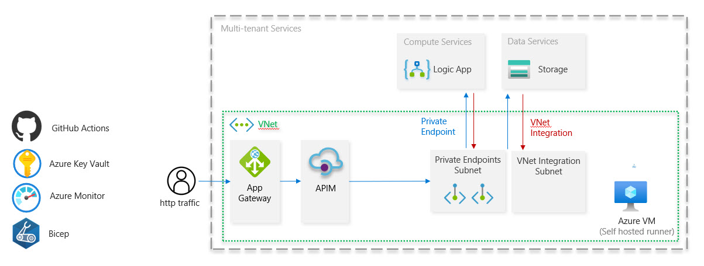

# Azure IPaaS Accelerator

Getting started with an enterprise integration platform for deployment into public sector and regulated industries often requires weeks of research, trial and error.
The Azure Enterprise Integration Starter is designed to accelerate enterprises building iPaaS solutions on Azure.

## Goals

- Enable enterprises to deploy a basic integration starter with private networking to dev/test and prod
- Including services

  - App Gateway
  - APIM
  - Logic App
  - Key Vault
  - Storage Account
  - VNet Integration and Private Endpoints
  - GitHub Actions with self-hosted runner
  - BICEP

- Enable Microsoft partners to deliver Integration Go-Fast (Light) engagements in 2 weeks that extend the Integration Starter with the customer's requirements and additional services

  - Service Bus
  - Event Grid
  - Azure Functions
  - CosmosDb and SQL DB
  - App Insights
  - .... more

- Demonstrate CI/CD and IaC for an integration solution using Bicep
- Demonstrate CI/CD for APIM

## Guiding principles

- Follow today's best practices using released to production (GA) services

## Get started with the Enterprise Integration Starter

To get going with the project follow the [getting started documentation](docs/getting-started.md)

