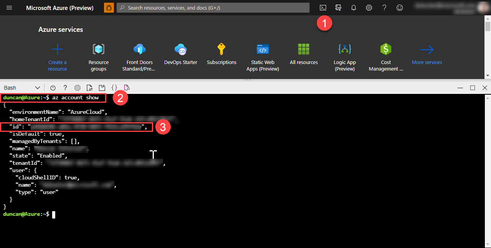
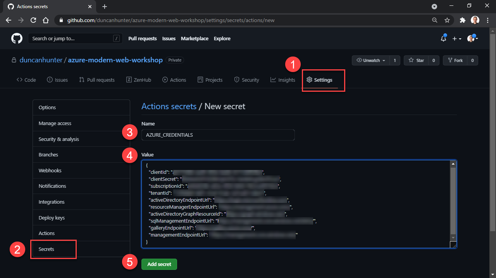
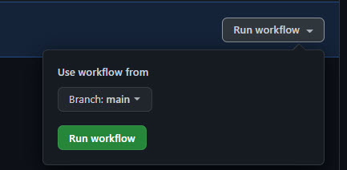
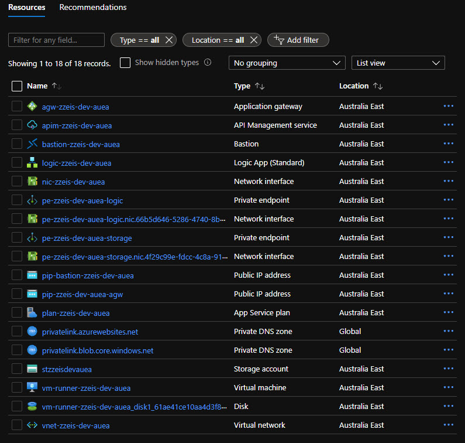
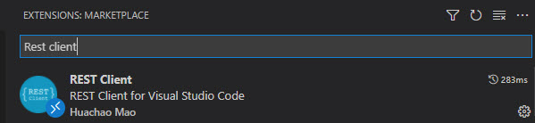

# Getting Started

## 1 - Fork and pull the repository

Go to the [Enterprise Integration Starter repository](https://github.com/azure-modern-apps/enterprise-integration-starter/)

- Fork the repository, click the Fork button in the header of the repository.


Figure: The repository's fork button

- Checkout the repo locally

```BASH
 git clone github.com/{YOUR_USERNAME}/enterprise-integration-starter.git

 ## for example git clone github.com/janesmith/enterprise-integration-starter.git
```

## 2 - Create the resource group for your dev/test environment

To practice least privilige we only allow our deployment action to access a specific resource group. In the next step you will create a service principal that can access this resource group.

If you do not have the [Azure CLI](https://docs.microsoft.com/en-us/cli/azure/) installed you can use the Azure portal to access the az cli.

If you have the Azure CLI installed you can run this next command locally, but the simplest way to run this command is to run this command in the Azure Portal's Cloud Shell.

- Check you are using the right subscription and save your subscription id for the next step

```BASH
az account show
```


Image: Azure portal

- Create resource group

```BASH
az group create --location {LOCATION} --name {RESOURCE_GROUP_NAME}

## for example az group create --location australiaeast --name rg-eis-dev-auea
```

## 3 - Create a Service Principle and add it to GitHub secrets

We need to make a service principle and add it to your repositories GitHub Secrets. This gives GitHub the ability to deploy Azure resources automatically.

To have authorization to provision Azure Resources from GitHub we will need to make a [service principal](https://docs.microsoft.com/en-us/azure/active-directory/develop/app-objects-and-service-principals). A service principle is a set of keys we can get from running the below Azure CLI commands.

- Create a service prinicpal
  Change the xxx-xxx to be your your subscription id which we will have gotten from the 'id' field in the command we just ran.

```BASH
az ad sp create-for-rbac --name {SERVICE_PRINCIPAL_NAME} --sdk-auth --role contributor --scopes /subscriptions/{SUBSCRIPTION_ID}/resourceGroups/{RESOURCE_GROUP_NAME}

## for example  az ad sp create-for-rbac --name integration-starter --sdk-auth --role contributor --scopes /subscriptions/1111-1111-1111-1111/resourceGroups/rg-eis-dev-auea
```

- Add the service principle to your repositories GitHub Secrets with the name ```AZURE_CREDENTIALS_DEV```.


Image: Add secret to GitHub

> Note: If you get stuck you can follow the instructions from the community the GitHub Action [Azure Login ](https://github.com/marketplace/actions/azure-login) we will be using.

## 4 - Add remaining secrets to GitHub
We need to have a place to store a few variables for our pipeline and until GitHub variables are released we will use a mix of GitHub secrets, action yml file variables and ARM JSON file variables. 


- Add the below secrets
  - `AZURE_RESOURCE_GROUP_DEV` - Your unique resource group name. For example ```rg-eis-dev-auea```
  - `AZURE_SUBSCRIPTION_ID_DEV` - For example ```11111-11111-11111-11111-11111```
  - `LOGIC_APP_NAME_DEV ` - For example ```logic-eis-dev-auea```


## 5 - Update variables
The easiest way to do this is a find and replace through the project for '-eis-' and 'eis' as some names like storage do not have '-'.

- ```.github/workflows/logicApp.yml``` action file variables

```YML
env:
  LA_NAME: '{YOUR_LOGIC_APP_NAME}'
  APIM_NAME: '{YOUR_APIM_NAME}'
  WORKFLOW_NAME: '{YOUR_WORKFLOW_NAME}'

## for example
## env:
##   LA_NAME: 'logic-{YOUR_PROJECT_ALIAS}-dev-auea'
##   APIM_NAME: 'apim-{YOUR_PROJECT_ALIAS}-dev-aue'
##   WORKFLOW_NAME: '{YOUR_PROJECT_ALIAS}HttpRequest'
```

- ```templates/main-selfHostedRunner.parameters-dev.json``` self-hosted JSON file variables

```JSON
{
  "$schema": "https://schema.management.azure.com/schemas/2019-04-01/deploymentParameters.json#",
  "contentVersion": "1.0.0.0",
  "parameters": {
    "vnetName": {
      "value": "vnet-eis-dev-auea"
    }

/* {
   "$schema": "https://schema.management.azure.com/schemas/2019-04-01/deploymentParameters.json#",
   "contentVersion": "1.0.0.0",
   "parameters": {
     "vnetName": {
       "value": "vnet-{YOUR_PROJECT_ALIAS}-dev-auea"
     }
*/ 
```

- ```templates/main.parameters-dev.json``` main.bicep JSON file variables

```JSON
{
  "$schema": "https://schema.management.azure.com/schemas/2019-04-01/deploymentParameters.json#",
  "contentVersion": "1.0.0.0",
  "parameters": {
    "storageAccountName": {
      "value": "steisdevauea"
    }

  /* "$schema": "https://schema.management.azure.com/schemas/2019-04-01/deploymentParameters.json#",
  "contentVersion": "1.0.0.0",
  "parameters": {
    "storageAccountName": {
      "value": "st{YOUR_PROJECT_ALIAS}devauea"
    }
  */
```

## 6 - Rename Logic App folder
Rename the logic app workflow folder ```logicAppWorkflow/eisHttpRequest``` to match you variable names.

For example from ```eisHttpRequest``` to ```{ZOUR_PROJECT_ALIAS}HttpRequest```

## 7. Commit and push your changed variable names

```
git add .

git commit -m "Update variables"

git push
```

## 8. Create a self-hosted runner

This sample includes a workflow, [selfHostedRunner.yml](../.github/workflows/selfHostedRunner.yml), to assist with the creation of the self-hosted runner.  It is recommended to manually execute this GitHub workflow, which will provision the virtual network, subnets, [Azure Bastion](https://docs.microsoft.com/en-us/azure/bastion/bastion-overview), and the virtual machine to host the self-hosted runner.  Other workflows will utilise this self-hosted runner and the same virtual network as deployed here.

- Add runnner VM secret to GitHub secrets
  - `RUNNER_VM_ADMIN_USERNAME_DEV` - The username to use as the administrator on the self-hosted runner VM
  - `RUNNER_VM_ADMIN_PASSWORD_DEV` - The password for the administrator on the self-hosted runner VM

Please ensure that the credentials are recorded in a secure location, as they will be used later in the process to connect to the virtual machine.

- To manually execute the GitHub action got to your repositories GitHub actions and select the ```Create Resources for Self-Hosted Runner``` action.
- Select 'Run workflow' drop down and run the workflow.



Image: Manually trigger GitHub action

> Deployment failed message! If you get an error deploying the self-hosted runner saying 'Microsoft.Network/networkInterfaces/nic-eis-dev-auea was not found. Please make sure that the referenced resource exists, and that both resources are in the same region.' Please re run the GitHub action manually as nic will now be able to find the resource group.

## 9. Connecting to the self-hosted runner

In addition to the self-hosted runner VM, the above workflow will also deploy [Azure Bastion](https://docs.microsoft.com/en-us/azure/bastion/bastion-overview) into the virtual network.  This provides an easy and secure way to connect to the self-hosted runner VM.

For example, in this scenario, you could launch the [Azure Portal](https://portal.azure.com/) and navigate to the virtual machine deployed in the steps above.  On the VM Overview page, click `Connect`, select `Bastion` from the dropdown, and again click to `Use Bastion`.  Provide the username and password that were configured as secrets in the steps above and click `Connect`.

## 10. Configuring the self-hosted runner
   
- In a browser, open the desired GitHub repository, go to `Settings` -> `Actions` -> `Runners` -> `Add runner`. Also, see https://docs.github.com/en/actions/hosting-your-own-runners/adding-self-hosted-runners for more information on this step.

- Choose linux x64

- Connect to the virtual machine (as described above) and follow the provided instructions for the O/S and Architecture (the sample in this repository defaults to Linux & x64).  

- Use the prompted defaults

If successful, you should see the Runner listed in your repository, probably in the "Idle" state.  

- It is also recommended to install the self-hosted runner application to run on VM startup as per https://docs.github.com/en/actions/hosting-your-own-runners/configuring-the-self-hosted-runner-application-as-a-service
    
## 11. Required tools for the self-hosted runner

You will also need to install the necessary tooling on your self-hosted runner to support the actions they execute in your workflow.

The following are the required installations for the Linux hosts we use in our sample workflows:

- [Install the Azure CLI](https://docs.microsoft.com/en-us/cli/azure/install-azure-cli).  Specifically, this sample uses the [Ubuntu installation instructions](https://docs.microsoft.com/en-us/cli/azure/install-azure-cli-linux?pivots=apt)

- Install zip (for zip deployments of the logic app workflows).  On Linux, this command can be used:
```BASH
sudo apt install zip
```
- [Install Powershell](https://docs.microsoft.com/en-us/powershell/scripting/install/installing-powershell?view=powershell-7.1). Specifically, this sample uses the [Ubuntu 18.04 instructions](https://docs.microsoft.com/en-us/powershell/scripting/install/installing-powershell-core-on-linux?view=powershell-7.1#ubuntu-1804)

```BASH
# Update the list of packages
sudo apt-get update
# Install pre-requisite packages.
sudo apt-get install -y wget apt-transport-https software-properties-common
# Download the Microsoft repository GPG keys
wget -q https://packages.microsoft.com/config/ubuntu/18.04/packages-microsoft-prod.deb
# Register the Microsoft repository GPG keys
sudo dpkg -i packages-microsoft-prod.deb
# Update the list of products
sudo apt-get update
# Enable the "universe" repositories
sudo add-apt-repository universe
# Install PowerShell
sudo apt-get install -y powershell
# Start PowerShell
pwsh

```

- [Install the Azure Az Powershell module](https://docs.microsoft.com/en-us/powershell/azure/install-az-ps?view=azps-6.4.0), e.g.

```BASH
# Restart PowerShell if stopped from the previous commands
pwsh

# Run install commnand
Install-Module -Name Az -Scope CurrentUser -Repository PSGallery -Force

# exit Powershell
exit
```
 
## 12. Trigger the main actions
Two actions will trigger one after the other the first ```Bicep EIS Deployment``` will deploy the resources and when finished ```Build and Deploy Logic App``` will be trieggered to deploy the actual Logic App workflow code. 

To trigger the GitHub action ```.github/workflows/main.yml``` you need to commit a change to a file in the templates path.

- Either make a change to a template in the ```/templates``` folder and push your changes or manually trigger the ```Bicep EIS Deployment``` action in the GitHub actions UI.

> Note it will take up to an hour for the deployment due to APIM in the developer tier. You may find you need to manually retrigger the actions if they fail on the first run due to race conditions.

## 13. Review services deployed in the Azure portal



Image: Azure portal

## 14. Test calling the logic app
You should be finshed and be able to get a success response fromt he logic app.

- Execute a http POST call to ```http://{YOUR_APP_GATEWAY_IP}/logicapp/manual/invoke```

This can easily be done with postman but if you do not have it installed you can install the below vscode extension from https://marketplace.visualstudio.com/items?itemName=humao.rest-client. 

- Open the ```.http``` file in this project then update the {IP} and {APIM_SUBSCRIPTION_KEY} (from the portal) and click ```send request```.

```BASH
## To excute this in vscode you will need to have this exension installed https://marketplace.visualstudio.com/items?itemName=humao.rest-client

Send Request
POST http://{IP}/logicapp/manual/invoke HTTP/1.1
Content-Type: application/json
Ocp-Apim-Subscription-Key: {APIM_SUBSCRTIPTION_KEY}
Ocp-Apim-Trace: true

{}

```


Image: REST Client vscode extension
