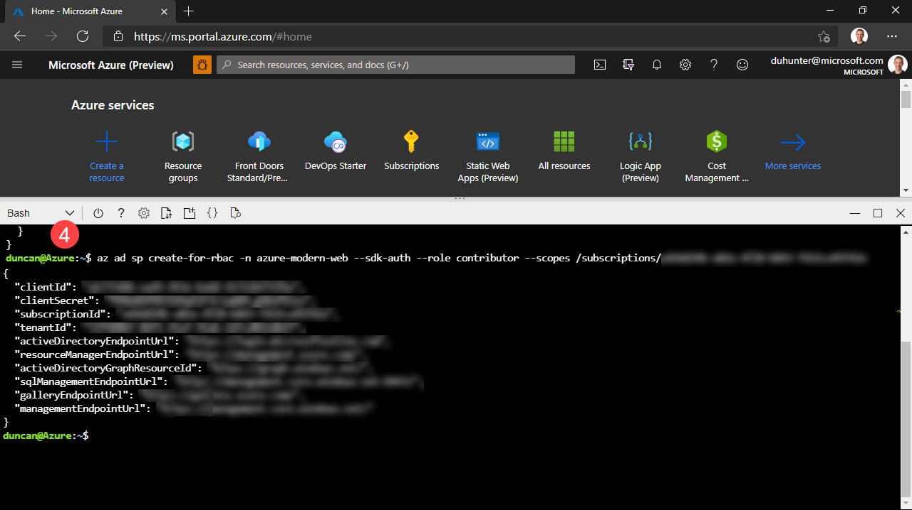

# Getting Started

To get going with the Enterprise Integration Starter we will:

1. Clone the [Enterprise Integration Starter repository](https://github.com/azure-modern-apps/enterprise-integration-starter/)
2. Create a Service Principle and add it to GitHub Secrets
3. Make a resource group
4. Update GitHub Action parameters
5. Make a pull request to trigger a deployment to a test environment

## 1 - Fork and pull the repository

Go to the [Enterprise Integration Starter repository](https://github.com/azure-modern-apps/enterprise-integration-starter/)

To fork the repository, click the Fork button in the header of the repository.


Figure: The repository's fork button

Checkout the repo locally

```BASH
 git clone git@github.com:{YOUR_USERNAME}/enterprise-integration-starter.git

 ## for example git clone git@github.com:janesmith/enterprise-integration-starter.git
```

## 2 - Create the resource group for your dev/test environment

To practice least privilige we only allow our deployment action to access a specific resource group. In the next step will will create a service principle that can access this resource group.

If you do not have the [Azure CLI](https://docs.microsoft.com/en-us/cli/azure/) installed you can use the Azure portal to access the az cli.

If you have the Azure CLI installed you can run this next command locally, but the simplest way to run this command is to run this command in the Azure Portal's Cloud Shell.

- Get your subscription id

```BASH
az account show
```


Image: Azure portal


```BASH
az group create --location {LOCATION} --name {RESOURCE_GROUP_NAME}

## for example az group create --location australiaeast --name rg-eis-dev-aue
```

## 3 - Create a Service Principle and add it to GitHub secrets

We need to make a service principle and add it to GitHub Secrets. This gives GitHub the ability to deploy Azure resources automatically.

To have authorization to provision Azure Resources from GitHub we will need to make a [service principal](https://docs.microsoft.com/en-us/azure/active-directory/develop/app-objects-and-service-principals). A service principle is a set of keys we can get from running the below Azure CLI commands.

```BASH
az ad sp create-for-rbac --name integration-starter --role contributor --scopes /subscriptions/{SUBSCRIPTION ID HERE}/resource/ --sdk-auth
```

## Make a resource group

## Update GitHub Action parameters

## Make a pull request to trigger a deployment to a test environment

# Install

## 3. Create Azure Credentials and add to a new GitHub repository

- Create a service prinicpal
  Change the xxx-xxx to be your your subscription id which we will have gotten from the 'id' field in the command we just ran.

```BASH
az ad sp create-for-rbac --sdk-auth --role contributor --scopes /subscriptions/{SUBSCRIPTION_ID}/resourceGroups/{RESOURCE_GROUP_NAME}

## for example  az ad sp create-for-rbac --sdk-auth --role contributor --scopes /subscriptions/1111-1111-1111-1111/resourceGroups/rg-eis-dev-aue
```


Image: Make a service prinicpal

- Create a new empty repository in GitHub and add a secret.


Image: Add secret to GitHub

> Note: If you get stuck you can follow the instructions from the community the GitHub Action [Azure Login ](https://github.com/marketplace/actions/azure-login) we will be using.
